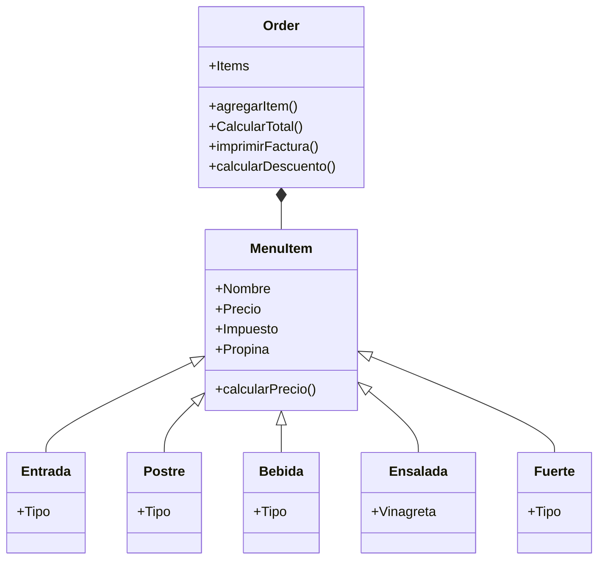

# Reto__3
By Juan Esteban Molina Rey (eljuanessoy)

### 1. Create class Line.  

 - *length*, *slope*, start, end: Instance attributes, two of them being points (so a line is composed at least of two points).
 - compute_length(): should return the line´s length
 - compute_slope(): should return the slope of the line from tje horizontal in deg.
 - compute_horizontal_cross(): should return if exists the intersection with x-axis
 - compute_vertical_cross(): should return if exists the intersection with y-axis

```python
import math

class Line:
    def __init__(self, start, end):
        self.start = start
        self.end = end

#Creamos la función para hallar la longitud de la linea (Teorema de pitagoras)

    def compute_length(self):
        return math.sqrt((self.end[0] - self.start[0])**2 + (self.end[1] - self.start[1])**2)

#Creamos la función para hallar la pendiente (pendiente = arctan(co/ca))

    def compute_slope(self):
        if self.end[0] - self.start[0] != 0:
            pendiente = (self.end[1] - self.start[1]) / (self.end[0] - self.start[0])
            return math.degrees(math.atan(pendiente))
        else:
            return None

#Creamos la función para hallar si hay cruce o no en el eje x: (El signo end_y sea diferente al signo de start_y)

    def compute_horizontal_cross(self):
        if self.start[1] < 0 and self.end[1] > 0 or self.start[1] > 0 and self.end[1]<0:
            return True
        else:
            return False
        
#Creamos la función para hallar si hay cruce o no en el eje y (El signo end_x sea distinto al signo de start_x)   

    def compute_vertical_cross(self):
        if (self.start[0] < 0 and self.end[0] > 0) or (self.start[0] > 0 and self.end[0]<0):
            return True
        else:
            return False


x1 = float(input("Ingrese la coordenada x de inicio: "))
y1 = float(input("Ingrese la coordenada y de inicio: "))
x2 = float(input("Ingrese la coordenada x de final: "))
y2 = float(input("Ingrese la coordenada y de final: "))

start = (x1, y1)
end = (x2, y2)
 
line = Line(start, end)
pendiente = line.compute_slope() 
interseccion_eje_y = line.compute_vertical_cross()
interseccion_eje_x = line.compute_horizontal_cross()

print("La longitud de la línea es: ", line.compute_length()) 
print("La pendiente en grados de la línea es: ", line.compute_slope())  

if interseccion_eje_y:
    print("La línea cruza el eje y")
else:
    print("La línea no cruza el eje y")

if interseccion_eje_x:
    print("La línea cruza el eje x")
else:
    print("La línea no cruza el eje x")
```

Redefine the class Rectangle, adding a new method of initialization using 4 Lines (composition at its best, a rectangle is compose of 4 lines).

```python
import math

class Punto:
    def __init__(self, x, y):
        self.x = x
        self.y = y

class Line:
    def __init__(self, start, end):
        self.start = start  
        self.end = end      

#Creamos la función para hallar la longitud de la linea (Teorema de pitagoras)

    def compute_length(self):
        return math.sqrt((self.end[0] - self.start[0])**2 + (self.end[1] - self.start[1])**2)

#Creamos la función para hallar la pendiente (pendiente = arctan(co/ca))

    def compute_slope(self):
        if self.end[0] - self.start[0] != 0:
            slope = (self.end[1] - self.start[1]) / (self.end[0] - self.start[0])  
            return math.degrees(math.atan(slope))
        else:
            return None

class Rectangulo:
    def __init__(self, ancho, largo, punto_centro) -> float:
        self.ancho = ancho          
        self.largo = largo          
        self.centro = punto_centro  
    
#Creamos la función para calcular el área del rectángulo

    def computar_area(self):
        resultado = self.ancho * self.largo
        return resultado
    
#Creamos la función para calcular el perímetro del rectángulo

    def computar_perimetro(self):
        resultado = 2 * (self.ancho + self.largo)
        return resultado
    
#Creamos la función para verificar si un punto está dentro del rectángulo
    def computar_interferencia_punto(self, Punto):
        if Punto.x < self.ancho and Punto.y < self.largo:
            return True 
        else:
            return False

class Cuadrado(Rectangulo):
    def __init__(self, lado, punto_centro):
        super().__init__(ancho=lado, largo=lado, punto_centro=punto_centro)

metodo = int(input("Ingrese un método, 1, 2, 3, 4: "))

if metodo == 1:
    largo = float(input("Ingrese el largo: "))
    ancho = float(input("Ingrese el ancho: "))
    punto_centro_x = int(input("Ingrese componente x para el punto centro: "))
    punto_centro_y = int(input("Ingrese componente y del punto centro: "))
    punto_izquierdo_x = punto_centro_x - (ancho / 2)
    punto_izquierdo_y = punto_centro_y - (largo / 2)

elif metodo == 2:
    largo = float(input("Ingrese el largo: "))
    ancho = float(input("Ingrese el ancho: "))
    punto_centro_x = int(input("Ingrese componente x para el punto centro: "))
    punto_centro_y = int(input("Ingrese componente y del punto centro: "))

elif metodo == 3:
    largo = float(input("Ingrese el largo: "))
    ancho = float(input("Ingrese el ancho: "))
    punto_centro_x = int(input("Ingrese componente x para el punto centro: "))
    punto_centro_y = int(input("Ingrese componente y del punto centro: "))
    punto_izquierdo_x = punto_centro_x - (ancho / 2)
    punto_izquierdo_y = punto_centro_y - (largo / 2)
    punto_derecho_x = punto_centro_x + (ancho / 2)
    punto_derecho_y = punto_centro_y + (largo / 2)

elif metodo == 4:
    start_x_ancho = float(input("Ingrese la coordenada x de inicio para el ancho: "))
    end_x_ancho = float(input("Ingrese la coordenada x de final para el ancho: "))
    start_y_ancho = float(input("Ingrese la coordenada y de inicio para el ancho: "))
    end_y_ancho = float(input("Ingrese la coordenada y de final para el ancho: "))

    start_x_largo = float(input("Ingrese la coordenada x de inicio para el largo: "))
    end_x_largo = float(input("Ingrese la coordenada x de final para el largo: "))
    start_y_largo = float(input("Ingrese la coordenada y de inicio para el largo: "))
    end_y_largo = float(input("Ingrese la coordenada y de final para el largo: "))

    linea_ancho = Line((start_x_ancho, start_y_ancho), (end_x_ancho, end_y_ancho))
    linea_largo = Line((start_x_largo, start_y_largo), (end_x_largo, end_y_largo))

    ancho = linea_ancho.compute_length()
    largo = linea_largo.compute_length()

    punto_centro_x = (start_x_ancho + end_x_ancho) / 2
    punto_centro_y = (start_y_ancho + end_y_ancho) / 2

else:
    print("Ingrese un método válido")

r = Rectangulo(ancho, largo, Punto(punto_centro_x, punto_centro_y))
print("El área del rectángulo es:", r.computar_area(), "y el perímetro del rectángulo es:", r.computar_perimetro())

c = Cuadrado(lado=ancho, punto_centro=Punto(punto_centro_x, punto_centro_y))
print("El área del cuadrado es:", c.computar_area(), "y el perímetro del cuadrado es:", c.computar_perimetro())

interferencia_punto_x = int(input("Ingrese coordenada x: "))
interferencia_punto_y = int(input("Ingrese coordenada y: "))
interferencia_punto = Punto(interferencia_punto_x, interferencia_punto_y)
interferencia = r.computar_interferencia_punto(interferencia_punto)

if interferencia:
    print("Las coordenadas dadas están dentro del rectángulo")
else:
    print("Las coordenadas dadas no están dentro del rectángulo")
```

### 2. **Restaurant scenario:** You want to design a program to calculate the bill for a customer's order in a restaurant.

- Define a base class *MenuItem*: This class should have attributes like name, price, and a method to calculate the total price.
- Create subclasses for different types of menu items: Inherit from *MenuItem* and define properties specific to each type (e.g., Beverage, Appetizer, MainCourse). 
- Define an Order class: This class should have a list of *MenuItem* objects and methods to add items, calculate the total bill amount, and potentially apply specific discounts based on the order composition.

Create a class diagram with all classes and their relationships. The menu should have at least 10 items. The code should follow PEP8 rules.

```python
class MenuItem:
    def __init__(self, nombre, precio, impuesto, propina):
        self.precio = precio
        self.impuesto = impuesto
        self.propina = propina
        self.nombre = nombre

    def calcularPrecio(self):
        impuesto = self.precio * self.impuesto
        propina = self.precio * self.propina
        total = self.precio + impuesto + propina
        return total
    
class Entrada(MenuItem):
    def __init__(self, nombre, precio, impuesto, propina, tipo):
        super().__init__(nombre, precio, impuesto, propina)
        self.tipo = tipo

class Postre(MenuItem):
    def __init__(self, nombre, precio, impuesto, propina, tipo):
        super().__init__(nombre, precio, impuesto, propina)
        self.tipo = tipo

class Bebida(MenuItem):
    def __init__(self, nombre, precio, impuesto, propina, tipo):
        super().__init__(nombre, precio, impuesto, propina)
        self.tipo = tipo

class Ensalada(MenuItem):
    def __init__(self, nombre, precio, impuesto, propina, vinagreta):
        super().__init__(nombre, precio, impuesto, propina)
        self.vinagreta = vinagreta

class Fuerte(MenuItem):
    def __init__(self, nombre, precio, impuesto, propina, tipo):
        super().__init__(nombre, precio, impuesto, propina)
        self.tipo = tipo

class Order:
    def __init__(self):
        self.items = []
    
    def agregarItem(self, item):
        self.items.append(item)       

    def calcularTotal(self):
        total = 0
        for item in self.items:
            total += item.calcularPrecio()
        return total

    def imprimirFactura(self):
        for item in self.items:
            print(item.nombre, "- $",item.calcularPrecio())
        print("Total: $",self.calcularTotal())
    
    def aplicarDescuento(self):        
        total = self.calcularTotal()
        if total > 450000:
            for item in self.items:
                item.precio = item.precio * 0.9
  


entrada1 = Entrada("Cacerola de Patatas Bravas", 56800, 0.7, 0.10, "Queso")
entrada2 = Entrada("Ración de Jamón Ibérico de Bellota", 223500, 0.7, 0.10, "Carne")
entrada3 = Entrada("Carpaccio de Salmón", 70000, 0.7, 0.10, "Pescado")

fuerte1 = Fuerte("Spaguetti a la Fiorentina", 44600, 0.7, 0.10, "Spaghetti")
fuerte2 = Fuerte("Pasta Pomodoro", 70000, 0.7, 0.10, "Pasta corta")
fuerte3 = Fuerte("Spaguetti al Guanciale", 75000, 0.7, 0.10, "Spaghetti")
fuerte4 = Fuerte("Pasta a la Rueda con Prosciutto y manzana confitada", 85000, 0.7, 0.10, "Fetuccini")
fuerte5 = Fuerte("Paella Mixta", 149800, 0.7, 0.10, "Paella")

postre1 = Postre('Torta Philadelphia', 29800, 0.7, 0.10, "Tarta")
postre2 = Postre("Copa Amaretto", 26000, 0.7, 0.10, "Copa")
postre3 = Postre("Gelato al Pistacchio", 40000, 0.7, 0.10, "Gelatina")
postre4 = Postre("Afogatto", 26000, 0.7, 0.10, "Helado")

bebida1 = Bebida("Bubble Fizz", 50000, 0.7, 0.10, "Licor")
bebida2 = Bebida("Capuccino", 10000, 0.7, 0.10, "Bebida caliente")
bebida3 = Bebida("Gassata de Frutos Verdes", 18900, 0.7, 0.10, 'Refresco')
bebida4 = Bebida("Limonada de Mango Biche", 16500, 0.7, 0.10, "Limonada")
bebida5 = Bebida("Jugo de Mora", 10000, 0.7, 0.10, "Jugo")

ensalada1 = Ensalada("Insalata Di garedino", 55000, 0.7, 0.10, "Vinagreta Oliva Limón")
ensalada2 = Ensalada("Vero Amore", 51000, 0.7, 0.10, "Vinagreta tradicional")


orden1 = Order()
orden1.agregarItem(ensalada2)
orden1.agregarItem(fuerte3)
orden1.agregarItem(postre3)
orden1.agregarItem(bebida4)

orden2 = Order()
orden2.agregarItem(entrada2)
orden2.agregarItem(fuerte5)
orden2.agregarItem(postre1)
orden2.agregarItem(bebida3)

orden3 = Order()
orden3.agregarItem(entrada1)
orden3.agregarItem(fuerte1)
orden3.agregarItem(postre4)
orden3.agregarItem(bebida3)


orden = int(input("Ingrese una orden, 1, 2, 3: "))

if orden == 1:
    print()
    print("La factura de la orden 1 es:")
    print()
    orden1.aplicarDescuento()
    orden1.imprimirFactura()
    print()

elif orden == 2:
    print()
    print("La factura de la orden 2 es:")
    print()
    orden2.aplicarDescuento()
    orden2.imprimirFactura()
    print()

elif orden == 3:
    print()
    print("La factura de la orden 3 es:")
    print()
    orden3.aplicarDescuento()
    orden3.imprimirFactura()
    print()

else:
    print("Ingrese un método válido")
```


